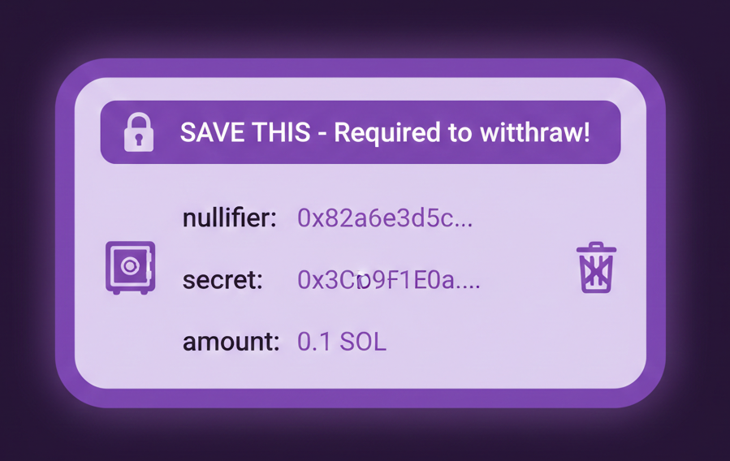

# Step 1: Hiding Deposit Details

We're going to start with the deposit. The transaction itself will always be onchain - anyone can see that Alice called the deposit function. But we don't want our program to store this information in the pool, because then when someone withdraws it it's an obvious link.

Right now, our deposit event logs the depositor's address and amount. Instead, we'll store and emit a commitment - a cryptographic hash that represents the deposit without revealing who can claim it later.

---

A commitment is just a hash. In the ZK world, we call it a commitment because you're "committing" to certain values without revealing them.

Think of it like a sealed envelope - everyone can see the envelope exists, but no one can see what's inside. Only you know. In our program, we will store a commitment each time someone deposits, and it will be a hash of their nullifier, a secret, and their amount.

The nullifier and secret are random numbers that only the depositer knows and will be used in order to withdraw. We'll get to what nullifier means later.

---
When you deposit, you save your nullifier, secret, and amount locally. This is your deposit note - your receipt.

If you lose this note, your funds are gone forever. There's no recovery mechanism because only you know the secrets.

---

In this step we'll:

1. Update deposit to accept a commitment parameter
2. Update the DepositEvent to show commitment instead of depositor address

Now even though the onchain record says "Alice called deposit function" there is no way of seeing which SOL in the pool was deposited by Alice.

---

