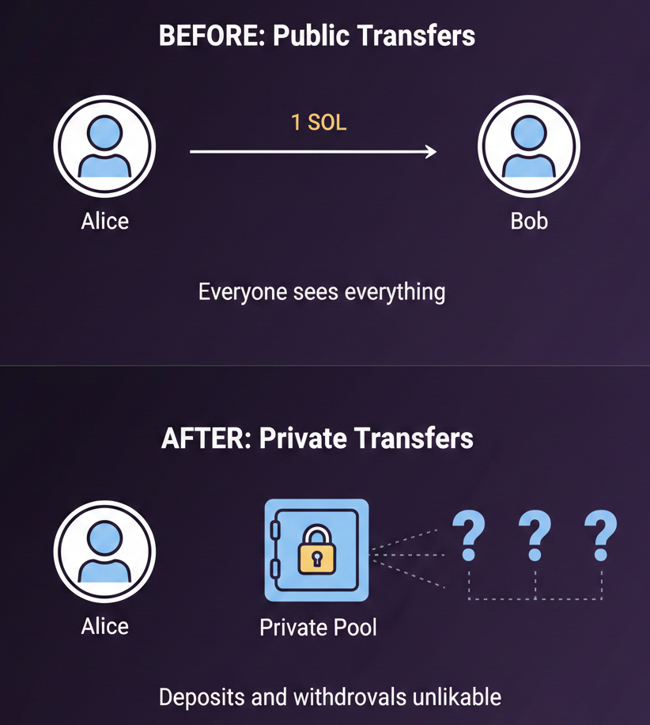

# Step 0: Introduction 

## What We're Building

In this next project we're building private transfers on Solana. Users deposit SOL into a shared pool, then withdraw later - but there's no way to link which deposit belongs to which withdrawal.

---

## What We're Actually Hiding

We're not hiding who deposits and who withdraws, because those things are visible onchain. We are hiding the connection between them. 

Without privacy, you've got something similar to the escrow you built earlier. Alice deposits, Bob withdraws. Everyone knows Alice sent funds to Bob. In the project we're going to build now, Alice deposits, Bob deposits, Carol deposits, and someone withdraws to some sort of address. No one knows if that address belongs to Alice, Bob, or Carol, or someone else entirely. 

Now, before we go any further - this is an educational project. It is not recommended to deploy this onto mainnet. Privacy tools have different legal implications depending on where you are, so check the compliance requirements in your country before building something like this for real users.

---

Anyway, the way this works is through zero-knowledge proofs. A zero-knowledge, or ZK, proof lets you prove something is true without revealing the underlying data - like proving you're over 18 without showing your actual birthday. In our case, you prove you made a valid deposi into the pool without revealing which one.

In this project, when you deposit, you'll generate random secrets on your device, hash them together, and send that hash plus your SOL to a pool on Solana. You get back a deposit note, which you need to save or give to whoever needs to withdraw.

Then when someone wants to withdraw from the pool, they use their deposit note to generate a ZK proof on their device, send it to Solana, Solana verifies it's legit, and releases the funds. The secrets never leave your device.

---

In this project we'll start with a public pool and turn it into a private pool in 6 steps. All the code used here is linked in the description. Feel free to clone the repo and follow along! By the end you'll understand how ZK works on Solana. Let's go!
