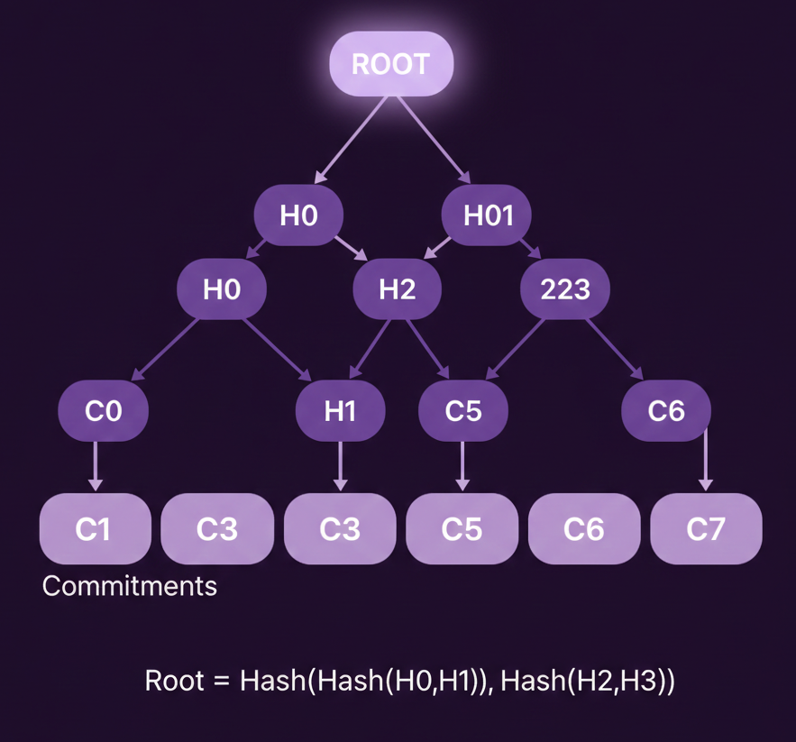

# Step 2: Proving Membership - Script

So now we've figured out how to deposit privately, let's move onto withdrawals. The first thing we need to do is prove our commitment exists in the pool.

The naive approach would be to store all commitments onchain and check against them. But with 1000 deposits, we'd need to send 1000 hashes in every withdrawal transaction. Solana transactions cannot be over 1kb at the time of this bootcamp so this won't work. We can use something called Merkle Treees.

---

A Merkle Tree is a binary tree where every node is a hash. At the bottom, the leaves are your commitments. Each pair of leaves gets hashed together to create their parent node. Those parents get paired and hashed again, and this continues level by level until you're left with just one hash at the top - the root, aka the Merkle root.

To prove a leaf exists, you just need the sibling hashes along the path to the root. For 1024 leaves, that's only 10 hashes which is around 320 bytes instead of 1024 commitments.

---

On Solana, we only store the root - a single 32-byte hash. When someone wants to prove their deposit exists, they provide a Merkle proof. We verify it against the stored root. This saves a lot of storage costs!

---

In this step we'll:

1. Add a `leaf_index` to track each deposit's position in the tree
2. Add constants for tree depth (10 levels = 1024 max deposits)
3. Store root history so proofs against recent roots still work
4. Update withdraw to validate the root exists

---

