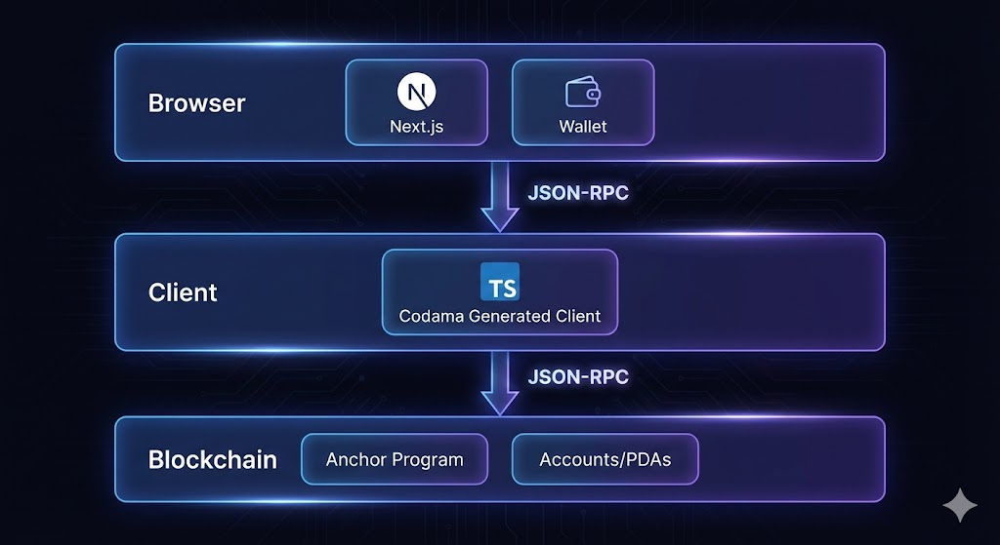
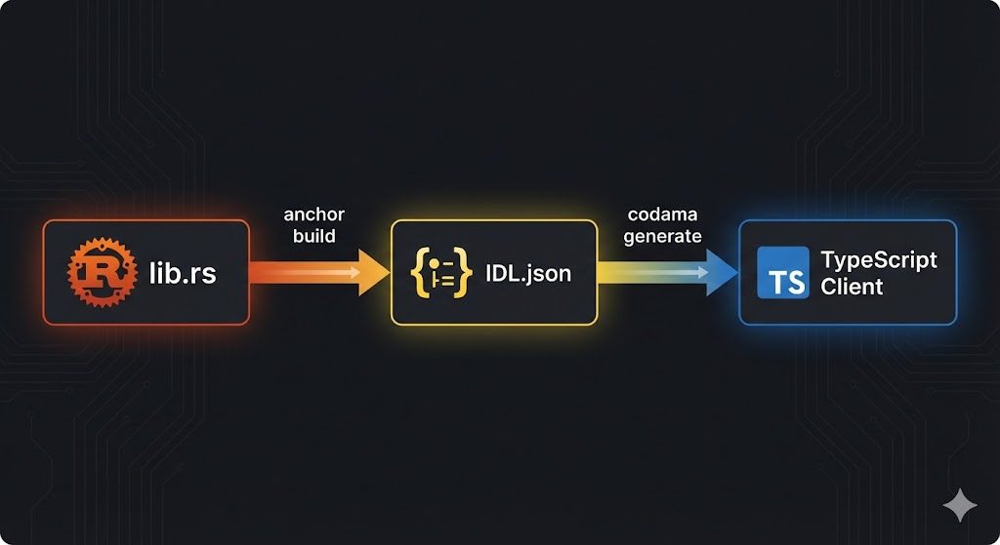
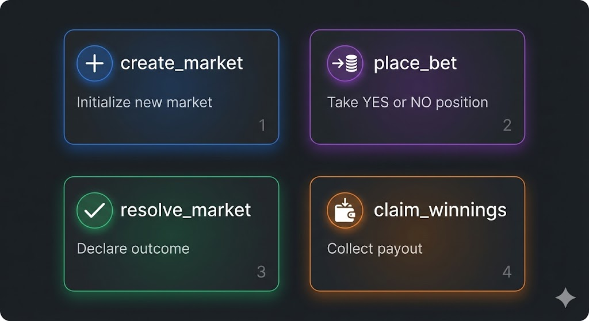

# Part 1: Why & What

**Duration:** 15 min

---

## 1.1 — The Problem (5 min | ~750 words)

<!-- Pure talking - explain prediction markets, why blockchain -->

Since late 2024, prediction markets have entered the mainstream discussion. The most famous ones being Kalshi and Polymarket.

> **[GRAPHIC: Screenshots of Polymarket and Kalshi homepages]**

Prediction market platforms play uniquely to the strengths of the Solana network as they benefit immensely from low fees and fast transaction speeds. If you're placing a five dollar position, you really cannot afford 1 dollars in transaction fee. Solana makes small stakes viable, allowing everybody to participate.

They especially grew in popularity when they correctly predicted the outcome of the 2024 American presidential election. This election was famously misjudged by professional pollsters while prediction markets correctly predicted the outcome.

> **[GRAPHIC: Polymarket 2024 election chart vs poll predictions]**

Why did the markets get it right? It comes down to skin in the game. Unlike polls where opinions are free, prediction markets require you to back your belief with money. If you have bad information, you lose money. If you have good information, you profit. Over time, the price moves toward the truth. People sometimes call this "the wisdom of crowds with accountability."

At their core, these products offer a really simple premise: you are presented with questions about outcomes. Most of these questions are in the form of a binary outcome, a question for which the answer is the inverse of the other. Let's review a few examples.

"The price of Bitcoin will close in 2026 above $150,000 — Yes or No?"

> **[GRAPHIC: Simple YES/NO card UI mockup with the Bitcoin question]**

You pick a side, you stake your money, and you wait.

We could create a more interesting contract by proposing different brackets:

"The price of Bitcoin will go above $150,000 but below $200,000"
"The price of Bitcoin will go above $200,000"

By composing these different binary true or false questions, we are able to find the closest outcome and refine our predictions. Do note, that some prediction markets have the capacity to use questions with more than two outcomes but today we will focus on designing with these binary question limitations. This keeps the Solana program logic simple and they still provide a great user experience.

So how do these markets actually work? The mechanics are straightforward. When you take a position, your funds go into a pool. There's a YES pool and a NO pool. When the outcome is decided, the winners split the losers' pool proportionally to their stake.

Let's say there's a market with 100 SOL in the YES pool and 50 SOL in the NO pool. You put 10 SOL on YES. That means you own 10% of the YES pool. If YES wins, you get your 10 SOL back plus 10% of the NO pool — that's 5 SOL profit. If NO wins, you lose your 10 SOL and it gets distributed to the NO side.

This creates a natural price discovery mechanism. If most people think YES will win, more money flows into the YES pool. But that also means the payout for YES gets smaller. At some point, contrarians see value in taking the other side. The ratio between the pools reflects the crowd's collective probability estimate.

This is what we're going to build today.

> **[GRAPHIC: Preview of the finished app — markets list with active markets]**

By the end of this lecture, you'll understand how to create a prediction market on Solana from scratch. We'll cover the full stack, from the Rust program running on-chain to the React frontend that users interact with.

On the Solana side, we'll write four instructions: create a market, take a position, resolve the market, and claim winnings. We'll go over account design and constraints. We'll look at the validation logic that prevents people from taking positions after the deadline or claiming twice.

On the frontend side, we'll see how to fetch all markets from the chain, decode the account data, and display it in React components. We'll use a code generation tool called Codama that reads our Rust program and generates TypeScript client code automatically. This means we get type-safe instruction builders without writing serialization logic by hand.

The architecture might seem like a lot at first, but it breaks down into clean layers. Let's start by looking at the big picture.

---

## 1.2 — Architecture Overview (10 min | ~550 words)

<!-- Heavy on diagrams - let visuals breathe -->

Let's get an overview of the architecture. This is a full stack lecture, so while we will go over the program, we will focus more on the full integration between the application, signers and transactions.

The frontend of our application will use Next.js. We could totally use other React frameworks or even other JavaScript frameworks, but Next.js offers an easy way to get good production standards like server-side rendering capabilities and many optimizations for which we don't want to spend our time setting up manually.

> **[GRAPHIC: Next.js logo + brief feature highlights]**

The frontend will be split into two pages. The first page will show all the currently active markets — that would be our Bitcoin above $150,000 example — with components allowing users to take a position.

> **[GRAPHIC: Screenshot of markets list page with market cards]**

The second page will be a profit and loss page with statistics on past markets. We will use this page as an example of how you can display data and present it nicely for your users.

> **[GRAPHIC: Screenshot of activity/PnL page with stats]**

These components will talk to the blockchain using two easy-to-use libraries that are part of the Solana SDK suite. These will be `@solana/client` and `@solana/react-hooks`. These will handle the wallet connection and communication to the RPC layer for us.

> **[GRAPHIC: Code snippet showing wallet connection setup]**

When it comes time to connect to our program and submit instructions or read from accounts, we will use a TypeScript client that will be generated from the Codama IDL library.

This part is incredibly useful as it will give us a fully typed client that is able to serialize instructions and quickly communicate with our program. We will explore how to generate this client and consume it with the frontend Solana libraries. The overall architecture and communication will be a direct communication from UI to the program without indexing or other more advanced techniques.

Transactions will be sent to an RPC on devnet and our Anchor program will take care of acting on the different accounts and PDAs.

One caveat I would like to discuss is that this is not a production-ready prediction market. The use of an oracle would typically be recommended to resolve the market as it would build trust in the process. In our implementation, the market creator resolves the outcome.

As you can see, we've kept our account design pretty simple in this implementation. Each market will be a PDA so that we can easily reconstruct them on-chain, and each position holding a user's stake will also be a PDA.

Our whole design will contain a simple count of 4 instructions:

1. **create_market** — initialize a new market with a question
2. **place_bet** — take a position on YES or NO
3. **resolve_market** — creator declares the outcome
4. **claim_winnings** — winners withdraw their payout

The beauty of Solana programs is that these four simple instructions can be composed into a fully functional prediction market.

At this point you should have a clear mental model: a market is two pools, a market account, and a handful of instructions that move lamports around with strict rules. Nothing magical, just constrained state transitions. That's why Solana is a great fit: it makes these tiny, frequent bets cheap and fast, while keeping everything transparent.

In the next part we'll get hands-on with the on-chain program. We'll define the account data, derive PDAs, and write the instruction handlers with the guardrails that prevent late bets or double claims. We'll also talk about the tradeoffs we're making (like creator-resolved outcomes) and how you might upgrade this in a production system.

Once the program is solid, we'll climb back up the stack and wire the UI with a generated client. Let's start building.
