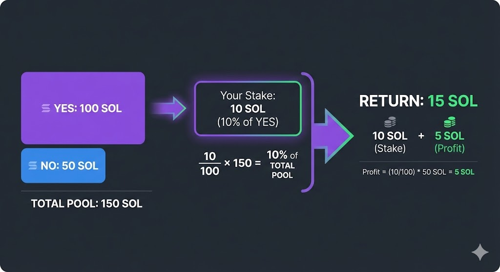

# Part 1: Why & What

**Duration:** 15 min

---

## 1.1 — The Problem (5 min | ~750 words)

<!-- Pure talking - explain prediction markets, why blockchain -->

Since late 2024, prediction markets have entered the mainstream discussion. The most famous ones being Kalshi and Polymarket.

> **[GRAPHIC: Screenshots of Polymarket and Kalshi homepages]**

Prediction market platforms play uniquely to the strengths of the Solana network as they benefit immensely from low fees and fast transaction speeds. If you're placing a five dollar position, you really cannot afford 1 dollars in transaction fee. Solana makes small stakes viable, allowing everybody to participate.

They especially grew in popularity when they correctly predicted the outcome of the 2024 American presidential election. This election was famously misjudged by professional pollsters while prediction markets correctly predicted the outcome.

> **[GRAPHIC: Polymarket 2024 election chart vs poll predictions]**

Why did the markets get it right? It comes down to skin in the game. Unlike polls where opinions are free, prediction markets require you to back your belief with money. If you have bad information, you lose money. If you have good information, you profit. Over time, the price moves toward the truth. People sometimes call this "the wisdom of crowds with accountability."

At their core, these products offer a really simple premise: you are presented with questions about outcomes. Most of these questions are in the form of a binary outcome, a question for which the answer is the inverse of the other. Let's review a few examples.

"The price of Bitcoin will close in 2026 above $150,000 — Yes or No?"

> **[GRAPHIC: Simple YES/NO card UI mockup with the Bitcoin question]**

You pick a side, you stake your money, and you wait.

We could create a more interesting contract by proposing different brackets:

"The price of Bitcoin will go above $150,000 but below $200,000"
"The price of Bitcoin will go above $200,000"

By composing these different binary true or false questions, we are able to find the closest outcome and refine our predictions. Do note, that some prediction markets have the capacity to use questions with more than two outcomes but today we will focus on designing with these binary question limitations. This keeps the Solana program logic simple and they still provide a great user experience.

So how do these markets actually work? The mechanics are straightforward. When you take a position, your funds go into a pool. There's a YES pool and a NO pool. When the outcome is decided, the winners split the losers' pool proportionally to their stake.


Let's say there's a market with 100 SOL in the YES pool and 50 SOL in the NO pool. You put 10 SOL on YES. That means you own 10% of the YES pool. If YES wins, you get your 10 SOL back plus 10% of the NO pool — that's 5 SOL profit. If NO wins, you lose your 10 SOL and it gets distributed to the NO side.



This creates a natural price discovery mechanism. If most people think YES will win, more money flows into the YES pool. But that also means the payout for YES gets smaller. At some point, contrarians see value in taking the other side. The ratio between the pools reflects the crowd's collective probability estimate.

This is what we're going to build today.

> **[GRAPHIC: Preview of the finished app — markets list with active markets]**

By the end of this lecture, you'll understand how to create a prediction market on Solana from scratch. We'll cover the full stack, from the Rust program running on-chain to the React frontend that users interact with.

On the Solana side, we'll write four instructions: create a market, take a position, resolve the market, and claim winnings. We'll go over account design and constraints. We'll look at the validation logic that prevents people from taking positions after the deadline or claiming twice.

On the frontend side, we'll see how to fetch all markets from the chain, decode the account data, and display it in React components. We'll use a code generation tool called Codama that reads our Rust program and generates TypeScript client code automatically. This means we get type-safe instruction builders without writing serialization logic by hand.

The architecture might seem like a lot at first, but it breaks down into clean layers. Let's start by looking at the big picture.


---

## 1.2 — Architecture Overview (10 min | ~550 words)

<!-- Heavy on diagrams - let visuals breathe -->

Let's get an overview of the architecture. This is a full stack lecture, so while we will go over the program, we will focus more on the full integration between the application, signers and transactions.


The frontend of our application will use Next.js. We could totally use other React frameworks or even other JavaScript frameworks, but Next.js offers an easy way to get good production standards like server-side rendering capabilities and many optimizations for which we don't want to spend our time setting up manually.

> **[GRAPHIC: Next.js logo + brief feature highlights]**

The frontend will be split into two pages. The first page will show all the currently active markets — that would be our Bitcoin above $150,000 example — with components allowing users to take a position.

> **[GRAPHIC: Screenshot of markets list page with market cards]**

The second page will be a profit and loss page with statistics on past markets. We will use this page as an example of how you can display data and present it nicely for your users.

> **[GRAPHIC: Screenshot of activity/PnL page with stats]**

These components will talk to the blockchain using two easy-to-use libraries that are part of the Solana SDK suite. These will be `@solana/client` and `@solana/react-hooks`. These will handle the wallet connection and communication to the RPC layer for us.

> **[GRAPHIC: Code snippet showing wallet connection setup]**

When it comes time to connect to our program and submit instructions or read from accounts, we will use a TypeScript client that will be generated from the Codama IDL library.

This part is incredibly useful as it will give us a fully typed client that is able to serialize instructions and quickly communicate with our program. We will explore how to generate this client and consume it with the frontend Solana libraries. The overall architecture and communication will be a direct communication from UI to the program without indexing or other more advanced techniques.


Transactions will be sent to an RPC on devnet and our Anchor program will take care of acting on the different accounts and PDAs.

One caveat I would like to discuss is that this is not a production-ready prediction market. The use of an oracle would typically be recommended to resolve the market as it would build trust in the process. In our implementation, the market creator resolves the outcome.


As you can see, we've kept our account design pretty simple in this implementation. Each market will be a PDA so that we can easily reconstruct them on-chain, and each position holding a user's stake will also be a PDA.

Our whole design will contain a simple count of 4 instructions:

1. **create_market** — initialize a new market with a question
2. **place_bet** — take a position on YES or NO
3. **resolve_market** — creator declares the outcome
4. **claim_winnings** — winners withdraw their payout


The beauty of Solana programs is that these four simple instructions can be composed into a fully functional prediction market.

At this point you should have a clear mental model: a market is two pools, a market account, and a handful of instructions that move lamports around with strict rules. Nothing magical, just constrained state transitions. That's why Solana is a great fit: it makes these tiny, frequent bets cheap and fast, while keeping everything transparent.

In the next part we'll get hands-on with the on-chain program. We'll define the account data, derive PDAs, and write the instruction handlers with the guardrails that prevent late bets or double claims. We'll also talk about the tradeoffs we're making (like creator-resolved outcomes) and how you might upgrade this in a production system.

Once the program is solid, we'll climb back up the stack and wire the UI with a generated client. Let's start building.

# Part 2: On-Chain Program

**Duration:** 30 min

---

## 2.1 — Account Structures (10 min | ~900 words)

<!-- Screen share code - walk through state.rs -->

Alright, before we write any code, we need to decide what lives on-chain. On Solana, programs are basically pure functions over accounts: each instruction takes accounts in, reads them, and writes them back out. So the account layout is the real API. Get that right and everything else becomes straightforward state transitions.

For this build, we're keeping it minimal. Two accounts: `Market` for global state, and `UserPosition` for a single user's exposure. No order books, no price history, no off-chain references. Just the data we need to validate bets and pay people out. That's the whole idea.

We define these in `state.rs` with `#[account]` and `#[derive(InitSpace)]`. Quick note: `InitSpace` matters because Solana makes you allocate space up front. Too small and the transaction fails, too big and you burn lamports forever. With `InitSpace` and `#[max_len]`, Anchor does the sizing for us, so we don't have to.

**Walkthrough: `anchor/programs/prediction_market/src/state.rs`**

```rust
pub struct Market {
    pub creator: Pubkey,        // 32 bytes - who can resolve
    pub market_id: u64,         // 8 bytes - unique ID
    pub question: String,       // variable - "Will X happen?"
    pub resolution_time: i64,   // 8 bytes - betting deadline
    pub yes_pool: u64,          // 8 bytes - total YES lamports
    pub no_pool: u64,           // 8 bytes - total NO lamports
    pub resolved: bool,         // 1 byte - is outcome set?
    pub outcome: Option<bool>,  // 2 bytes - None, Some(true), Some(false)
    pub bump: u8,               // 1 byte - PDA bump seed
}
```

Let's walk it quickly, and I'll keep it light. `creator` is the authority who can resolve the market. Think of it as the admin. We store it so later instructions can check the signer. It also goes into the PDA seeds, so one creator can run a bunch of markets without collisions.

`market_id` is a u64 we pass in. It's only unique per creator, like a per-creator sequence number. The PDA seed uses `b"market" + creator + market_id`, so two creators can both have market_id 1 and still get different addresses. The cool part is deterministic discovery: given a creator and id, a client can derive the market address without any registry.

`question` is the prompt. We cap it at 200 characters with `MAX_QUESTION_LEN` so the account stays small and predictable. A `String` in Anchor includes a 4 byte length prefix plus the bytes, so max length matters for rent. It also keeps the UI tidy.

`resolution_time` is an i64 unix timestamp. We use it to reject markets created in the past and to close betting after the deadline. On Solana, `Clock::get()?.unix_timestamp` is the source of time. It's not perfectly precise, but it's fine for a tutorial.

`yes_pool` and `no_pool` are just running totals of lamports on each side. When a user bets, we move lamports into the market PDA and increment one of these pools. There is no pricing curve here; the implied probability is just the ratio of the two pools. Simple parimutuel math, nothing fancy.

`resolved` and `outcome` work together. `resolved` is a quick guard that prevents double resolution. `outcome` is an `Option<bool>` so we can represent three states: `None` (unresolved), `Some(true)` (YES wins), and `Some(false)` (NO wins). This avoids confusing "not resolved" with "NO".

`bump` stores the PDA bump seed. We compute it when the account is created and store it on-chain so later instructions can re-derive the PDA without the client passing it. You'll see this in the account constraints for `claim_winnings`, where the PDA is validated by seeds and bump.

Next up is `UserPosition`. This account is created per user per market, and it aggregates their bets over time. Instead of making a new account for every bet, we keep one account and update its totals. That keeps account management and UI logic simple.

```rust
pub struct UserPosition {
    pub market: Pubkey,      // which market this position belongs to
    pub user: Pubkey,        // owner of the position
    pub yes_amount: u64,     // lamports bet on YES
    pub no_amount: u64,      // lamports bet on NO
    pub claimed: bool,       // has the payout been claimed?
    pub bump: u8,            // PDA bump seed
}
```

So `market` and `user` just tie this position to a specific market and owner. Storing both makes the account self-describing and lets us add constraints like `user_position.user == user.key()` later.

`yes_amount` and `no_amount` are cumulative totals. We intentionally allow both to be non-zero, which means a user can hedge or change their mind by placing bets on both sides. We don't net anything out here; when we pay out, only the winning side counts.

`claimed` is a one-way flag. Once a user withdraws their winnings, we set it to true and refuse any further claims. It prevents double spending even if someone resubmits the same transaction. `bump` plays the same role as in the `Market` account: it lets us re-derive the PDA deterministically.

Quick note on space: for a `Market`, the size is the fixed fields plus the 4 byte string length prefix and the 200 byte max question. For `UserPosition`, it is mostly fixed: two pubkeys, two u64 totals, a bool, and a bump. Anchor's `INIT_SPACE` keeps this accurate so we can allocate `8 + Market::INIT_SPACE` and `8 + UserPosition::INIT_SPACE` without hand math.

Net result: a small, stable account model. It's also easy to extend: you could add a `fee_bps` field, an `oracle` pubkey, or a `category` enum without touching the core flow. For the tutorial, these two accounts are enough. Now we can move on to the instruction logic that mutates them.

**Discussion Points:**
- Why each field exists
- How `Option<bool>` represents three states (unresolved, yes, no)
- Why we keep one `UserPosition` per user per market
- How PDA seeds give deterministic addresses
- Space calculation for rent exemption


---

## 2.2a — Function: create_market (5 min | ~400 words)

<!-- Code walkthrough - highlight validation pattern -->

Alright, `create_market` is where everything starts. Think of it as the setup step. It allocates the market PDA, stores the metadata, and zeros the pools. In Anchor, most of the setup lives in the accounts struct rather than the instruction body.

Take a quick look at the `CreateMarket` accounts in `lib.rs`: we use `init`, `payer = creator`, `space = 8 + Market::INIT_SPACE`, and the seeds `b"market"`, the creator pubkey, and the `market_id` bytes. That gives us a deterministic address. Same creator + id means the same PDA every time. Try to create it twice and the second transaction fails because the account already exists.

The inputs are simple: `market_id`, the question string, and the resolution time. We validate both before touching state. The question length check enforces `MAX_QUESTION_LEN` so the account fits the space we allocated. The time check ensures the market is in the future; otherwise you'd create a market that is already closed.

**Walkthrough: `anchor/programs/prediction_market/src/lib.rs`**

```rust
pub fn create_market(
    ctx: Context<CreateMarket>,
    market_id: u64,
    question: String,
    resolution_time: i64,
) -> Result<()> {
    require!(question.len() <= MAX_QUESTION_LEN, MarketError::Overflow);

    let clock = Clock::get()?;
    require!(
        resolution_time > clock.unix_timestamp,
        MarketError::ResolutionTimeInPast
    );

    let market = &mut ctx.accounts.market;
    market.creator = ctx.accounts.creator.key();
    market.market_id = market_id;
    market.question = question;
    market.resolution_time = resolution_time;
    market.yes_pool = 0;
    market.no_pool = 0;
    market.resolved = false;
    market.outcome = None;
    market.bump = ctx.bumps.market;

    Ok(())
}
```

After validation, we fill every field explicitly. No surprises. That keeps the account predictable and avoids relying on defaults. We also store the bump from `ctx.bumps.market` so later instructions can validate the PDA without the client supplying the bump each time.

By the way, we store `market_id` on the account even though it is already part of the PDA seeds. It's handy for the UI and it lets us re-derive the PDA later in `claim_winnings` without asking the user to pass it. We also store `resolution_time` as an i64 because the clock sysvar uses i64, so we avoid casting. In production you'd probably add more validation here - a minimum duration, a sanity check on the question content, or a small creation fee to prevent spam. For the tutorial, the two guards are enough.

One quick design choice: we don't store a global list of markets. On Solana, enumerating all accounts is an RPC or indexer problem, not a program responsibility. Keeping the program focused makes it cheaper to run and easier to audit. Clients can discover markets by scanning PDAs or by indexing off-chain if they need a search experience.

**Key Point:** Validation happens BEFORE state changes


---

## 2.2b — Function: place_bet (7 min | ~500 words)

<!-- Code + money flow diagram - slower pace -->

Alright, `place_bet` is the hot path. Every YES/NO click hits this, so we keep it lean. Think of it as three steps: validate, move lamports into the market PDA, and update accounting in both the market and the user's position.

First guard: `amount > 0`. It sounds trivial, but it prevents no-op transactions that could still create position accounts and waste rent. Next guard checks the deadline: if `Clock::get()?.unix_timestamp` is greater than or equal to `resolution_time`, betting is closed. We do this before any transfer so we never move funds after the cutoff.

Then we do the transfer. Nothing fancy: we use the system program to move native lamports from the user to the market PDA. The user signs the transaction, and the market account simply receives funds. Because the PDA is program-owned, it does not need to sign to receive lamports. If you wanted to bet with an SPL token like USDC, this is where you'd CPI into the token program instead.

**Diagram: Money Flow**

```
   User Wallet                    Market PDA
       │                              │
       │    transfer(amount)          │
       ├─────────────────────────────►│
       │                              │
       ▼                              ▼
  balance -= amt              yes_pool += amt
                                  (or no_pool)
```

**Walkthrough: `anchor/programs/prediction_market/src/lib.rs`**

```rust
pub fn place_bet(
    ctx: Context<PlaceBet>,
    amount: u64,
    bet_yes: bool,
) -> Result<()> {
    require!(amount > 0, MarketError::InvalidBetAmount);

    let clock = Clock::get()?;
    let market = &ctx.accounts.market;
    require!(
        clock.unix_timestamp < market.resolution_time,
        MarketError::BettingClosed
    );

    transfer(
        CpiContext::new(
            ctx.accounts.system_program.to_account_info(),
            Transfer {
                from: ctx.accounts.user.to_account_info(),
                to: ctx.accounts.market.to_account_info(),
            },
        ),
        amount,
    )?;

    // Update pools
    let market = &mut ctx.accounts.market;
    if bet_yes {
        market.yes_pool = market.yes_pool.checked_add(amount)
            .ok_or(MarketError::Overflow)?;
    } else {
        market.no_pool = market.no_pool.checked_add(amount)
            .ok_or(MarketError::Overflow)?;
    }

    // Update user's position...
}
```

Only after the transfer succeeds do we update the pool totals. We use `checked_add` on u64 to prevent overflow. Overflow is rare in normal usage, but it is a common attack surface: if someone could wrap a pool to zero, they could distort the implied price or steal funds. Defensive math keeps the accounting sane.

Next we update the user's position. The `user_position` account is created with `init_if_needed`, which means the first bet pays rent and subsequent bets reuse the same account. On the first bet we set `market` and `user`, and we store the bump so we can verify the PDA later. On every bet we increment either `yes_amount` or `no_amount`.

Yep, a user can bet both sides over time. That's intentional. Some traders want to hedge, or to change their mind without closing an account. We don't net these positions out. When the market resolves, only the winning side counts. The losing side remains in the pool and is distributed to winners.

This is a simple parimutuel model, not an AMM. No curve, no slippage, no price protection. The "price" is just the ratio of pools at any given moment. That makes the logic easy to reason about and perfect for a tutorial. Once you understand this flow, you can swap in more advanced pricing if you want.

We also don't store an explicit price; the UI derives it on the fly from pool ratios. This keeps the on-chain state minimal and avoids extra rounding logic.

**Key Insight:** `checked_add` returns `None` on overflow instead of wrapping. This prevents attacks where someone could overflow the pool to zero.


---

## 2.2c — Function: claim_winnings (8 min | ~550 words)

<!-- Payout diagram + code - let math sink in -->

Alright, `claim_winnings` is the settlement step. It's the only instruction that moves lamports out of the market PDA, so we slow down and double-check everything here. The flow is: verify the market is resolved, verify the user has not claimed, compute the user's share, transfer lamports, and mark the claim as complete.

Before this happens, someone has to call `resolve_market` to set the outcome. In this tutorial, only the market creator can do that, and they can only do it after the resolution time. That's a trust assumption we're making to keep the program simple. In production you'd typically replace this with an oracle or a multi-sig to avoid a single point of failure.

**Diagram: Payout Calculation**

```
Example Market:
┌─────────────────────────────────────┐
│  YES Pool: 100 SOL                  │
│  NO Pool:   50 SOL                  │
│  Outcome: YES wins                  │
└─────────────────────────────────────┘

User bet 10 SOL on YES:
┌─────────────────────────────────────┐
│  Share of winners: 10/100 = 10%     │
│  Claim from losers: 50 × 10% = 5    │
│  Total payout: 10 + 5 = 15 SOL      │
└─────────────────────────────────────┘
```

**Walkthrough: `anchor/programs/prediction_market/src/lib.rs`**

```rust
pub fn claim_winnings(ctx: Context<ClaimWinnings>) -> Result<()> {
    let market = &ctx.accounts.market;
    let position = &ctx.accounts.user_position;

    // Guards
    require!(market.resolved, MarketError::NotResolved);
    require!(!position.claimed, MarketError::AlreadyClaimed);

    // Determine winning side
    let outcome = market.outcome.unwrap();
    let (user_winning_bet, total_winning_pool, total_losing_pool) = if outcome {
        (position.yes_amount, market.yes_pool, market.no_pool)
    } else {
        (position.no_amount, market.no_pool, market.yes_pool)
    };

    require!(user_winning_bet > 0, MarketError::NoWinnings);

    // Calculate payout
    let winnings = (user_winning_bet as u128)
        .checked_mul(total_losing_pool as u128)
        .ok_or(MarketError::Overflow)?
        .checked_div(total_winning_pool as u128)
        .ok_or(MarketError::Overflow)? as u64;
    let total_payout = user_winning_bet
        .checked_add(winnings)
        .ok_or(MarketError::Overflow)?;

    // Transfer from PDA to user
    let market_account_info = ctx.accounts.market.to_account_info();
    let user_account_info = ctx.accounts.user.to_account_info();

    **market_account_info.try_borrow_mut_lamports()? -= total_payout;
    **user_account_info.try_borrow_mut_lamports()? += total_payout;

    let position = &mut ctx.accounts.user_position;
    position.claimed = true;

    Ok(())
}
```

Pretty straightforward: the first guards are `market.resolved` and `!position.claimed`. Simple checks, but important. Without them, a user could claim before resolution or claim multiple times. We also verify that the user has a winning bet by checking that `user_winning_bet > 0`. If you only bet on the losing side, there is nothing to claim.

We determine the winning side by reading `market.outcome`. Because the market is resolved, this option should be `Some(true)` or `Some(false)`. We then pick the user's winning amount and the total winning and losing pools. That is all we need for payout; we don't store any per-bet history.

The payout formula is parimutuel: `winnings = (user_bet / winning_pool) * losing_pool`. In the actual code we do this with u128 math to avoid overflow when multiplying large numbers. Integer division floors the result, so there may be a few lamports left in the market PDA. That is normal in integer arithmetic and keeps the program deterministic.

To transfer lamports, we can't call the system program. The market PDA is program-owned, and the system program only moves lamports from signer accounts. Instead we directly mutate the lamports field on the market and user accounts. This is safe because the program owns the market account and we have already validated the user and the seeds in the account constraints.

We also rely on those account constraints to make sure the `user_position` PDA matches the signer.

After the transfer, we flip `position.claimed` to true. That makes the claim idempotent: if the user submits the transaction again, it will fail at the guard. We don't close the position account in this version, but we could add a `close = user` constraint to reclaim rent once claimed.

One last nuance worth calling out: if a user bet on both sides, only the winning side is paid out. The losing side stays in the pool and is distributed to winners, which includes them if they have a winning bet. This keeps the math consistent even when users hedge. The overall totals still balance because all lamports entering the market are either paid out or remain as dust.

This wraps the on-chain flow. We now have a full cycle: create a market, place bets, resolve it, and claim winnings. Next we'll take this program interface and generate a TypeScript client so the frontend can call these instructions with type safety.

# Part 3: The Codegen Layer

**Duration:** 15 min

---

## 3.1 — The Pipeline (5 min | ~350 words)

<!-- Diagram: Rust → IDL → TypeScript -->

Alright, Part 3 is all about the codegen layer. This is the bridge between our Rust program and the TypeScript frontend. Without it, you'd be hand-writing PDAs, instruction data, and account decoders. That is slow, easy to mess up, and honestly just not fun.

The big idea is simple: the Rust program is the source of truth, the IDL is the contract, and the generated client is what we actually use in the UI. When the program changes, we regenerate the client so everything stays in sync. No guessing about byte layouts, no copying account order from docs, no silent mismatches.

**Diagram: Code Generation Flow**

```
┌─────────────┐      ┌─────────────┐      ┌─────────────┐
│   lib.rs    │      │  IDL.json   │      │ TypeScript  │
│   (Rust)    │─────▶│ (Schema)    │─────▶│  Client     │
└─────────────┘      └─────────────┘      └─────────────┘
     anchor build         codama:js

   Source of           Intermediate        What frontend
   truth               representation      imports
```

**Commands:**
```bash
npm run anchor-build   # Rust → IDL
npm run codama:js      # IDL → TypeScript
```

`anchor-build` compiles the program and emits an IDL JSON. That file is a schema: instructions, accounts, types, and errors. Then `codama:js` reads the IDL and outputs a TypeScript client with instruction builders, PDA helpers, account decoders, and error types. This all lands in `app/generated/prediction_market/`.

Quick workflow note: any time you change a Rust account, instruction, or error, you should rerun both commands. That keeps the client up to date. Think of the generated code as read-only. You don't hand-edit it; you regenerate it.

If you ever see a weird mismatch in the UI, the first thing to check is whether the IDL and generated client are up to date. The fastest fix is often: rebuild, regenerate, and reload. That eliminates a whole category of "why is this deserializing wrong" bugs.

So the pipeline is short and boring, which is good. It lets you focus on the actual logic instead of byte layouts.

One more note: the IDL is also useful outside of TypeScript. Other teams can use it to generate clients in different languages. That makes your on-chain program more portable without you doing extra work.

If you ever want to sanity-check what the program exposes, open the IDL in `anchor/target/idl/`. You can see the full list of instructions, the account layouts, and the exact field names. It's a great debugging tool when something feels off in the UI.

And honestly, the generated code itself is a great learning resource. You can open any instruction file and see exactly which accounts are required, which ones are writable, and which signer is expected. It's like a living spec.

---

## 3.2 — Generated Code Walkthrough (10 min | ~800 words)

<!-- Side-by-side IDL vs TypeScript -->

Let's look at what the generated client actually gives us. We'll use `place_bet` as the example because it touches a little bit of everything: instruction args, PDAs, and serialization.

**From IDL to TypeScript:**

```json
// IDL snippet (anchor/target/idl/prediction_market.json)
{
  "name": "placeBet",
  "args": [
    { "name": "amount", "type": "u64" },
    { "name": "betYes", "type": "bool" }
  ]
}
```

```typescript
// Generated: app/generated/prediction_market/instructions/placeBet.ts
export async function getPlaceBetInstructionAsync(
  input: PlaceBetAsyncInput
): Promise<PlaceBetInstruction> {
  // Auto-derives PDAs from seeds
  const marketAddress = await findMarketPda(input.creator, input.marketId);
  const positionAddress = await findPositionPda(marketAddress, input.user);

  // Encodes args to bytes
  const data = getPlaceBetInstructionDataEncoder().encode({
    amount: input.amount,
    betYes: input.betYes,
  });

  return { keys: [...], data, programId };
}
```

On the left, the IDL just declares the instruction name and args. On the right, Codama turns that into a function we can call from the UI. We pass plain inputs, and it does all the hard stuff for us.

First, it derives PDAs. It knows the seeds for `Market` and `UserPosition` because they are in the IDL, so it can call `findMarketPda` and `findPositionPda` with the same seeds as the program. That means we never have to re-implement that logic in JavaScript.

Second, it serializes args into bytes. Rust uses Borsh under the hood, and the ordering matters. The generated encoder makes sure the bytes match the program exactly. For u64 values you will notice everything is `bigint` in TypeScript, which is a good thing. It keeps you from overflowing a normal JS number.

Third, it builds the account metas in the correct order, with the right writable and signer flags. That is one of the easiest places to make a mistake if you hand-roll instructions. The generated client saves you from that whole class of bugs.

The generated package also includes account decoders. For example, `getMarketDecoder()` knows how to read a `Market` account from raw bytes, including the 8 byte Anchor discriminator. That means you can fetch accounts with `getProgramAccounts`, then decode them with the same layout the program uses. Again, no manual layout math.

You'll also see helpers for errors and types. If the program returns `MarketError::BettingClosed`, the generated client can map that to a typed error on the frontend. That makes it easier to show real error messages instead of "Transaction failed."

Another nice piece is that the generated client exposes both encoders and decoders. That means you can write small tests that encode instruction data and compare it to expected bytes, or decode an account blob you captured from the RPC. It's a lightweight way to verify that your frontend and program are aligned.

So in practice, the generated client turns on-chain changes into frontend changes almost automatically. You update Rust, run the two commands, and the UI compiles against the new types. It's a huge productivity boost and it keeps the codebase honest.

This is why we spend time on the pipeline. It removes an entire layer of fragile glue code and lets you move fast without breaking things.

A small workflow tip: decide whether you want to commit the generated client. For tutorials I usually commit it so anyone can clone and run without extra steps. In a bigger team you might regenerate in CI instead. Either way, treat the generated folder as build output, not hand-written code.

There are a few extra goodies in the generated output that are worth calling out. You'll get the program ID as a constant, which keeps your frontend from drifting to the wrong address. You'll also get typed account interfaces, so if you hover a decoded `Market` object you see the exact fields and their types. That makes it harder to accidentally treat a u64 as a regular number.

The instruction builders usually come in sync and async flavors. The async ones are handy when PDAs are involved, because they need to derive addresses. The sync versions can be useful in tests or in scripts where you already computed the addresses.

You also get account discriminators. Anchor uses the first 8 bytes of an account to identify the type, and the generated client knows those discriminators. That means you can filter program accounts safely and decode only the ones you expect.

One thing people often miss: the client encoders and decoders are pure functions. That means you can test them in isolation. If you want to sanity-check a new field, decode a local fixture or encode a sample and compare it to what the program expects. It's a nice, tight feedback loop.

So when you hear "codegen," don't think of it as a nice-to-have. It's a guardrail. It keeps your on-chain and off-chain layers locked together as you iterate.

**Key Insight:** The generated client handles two hard problems:
1. **PDA derivation** - calculating deterministic addresses from seeds
2. **Serialization** - encoding args to bytes matching Rust's Borsh format

You never write this by hand.

# Part 4: Frontend Architecture

**Duration:** 20 min

---

## 4.1 — Component Hierarchy (5 min | ~300 words)

<!-- Tree diagram - mostly visual -->

Alright, let's zoom out and look at the frontend structure. We're using the Next.js App Router, so the top-level layout wraps everything in providers. That keeps the Solana connection and wallet state available across the app.

The mental model is simple: a layout with a Providers wrapper, then two pages. The home page is where you create and browse markets. The activity page is where you see your past positions. Everything else hangs off those two roots.

Keeping the tree shallow helps a lot. It makes it clear where data flows and where side effects live. You'll see that anything wallet-related or RPC-related lives inside `Providers`, while everything else is just UI components.

**Diagram: Component Tree**

```
App (layout.tsx)
 └─ Providers (Solana client + wallet)
     ├─ HomePage (page.tsx)
     │   ├─ CreateMarketForm
     │   └─ MarketsList
     │       └─ MarketCard (×N)
     │
     └─ ActivityPage (activity/page.tsx)
         └─ PositionsList
             └─ PositionCard (×N)
```

This is not fancy, and that's the point. A small tree keeps the tutorial focused and makes it easy to find where a given behavior lives. If you ever need to add more pages later, you already have a clean starting point.

One practical detail: `Providers` is a client component. Wallet adapters depend on `window`, so you keep that boundary clear. Everything under it can be client-side, while the layout itself can stay server-rendered. That gives you the nice Next.js defaults without fighting the wallet.

On the home page, `CreateMarketForm` is just a form with a question input and a resolution time picker. It calls the `create_market` instruction and then resets the UI. `MarketsList` is the read side: it fetches markets and renders a `MarketCard` for each one.

On the activity page, `PositionsList` does the same thing but for user positions. Each `PositionCard` can show the bet amount, the outcome, and whether the position has been claimed. That makes the flow feel complete without adding a bunch of extra complexity.

`Providers` is also where we set the cluster and connection. In this repo it's devnet, but it could be mainnet, localnet, or a custom RPC. You typically wire this up in `app/components/providers.tsx` and keep it centralized so every component gets the same connection and wallet context.

We also keep state local to the components that need it. `MarketCard` gets the decoded market plus a couple of callbacks. No global store, no heavy state management. For a tutorial, that keeps the mental load low.

---

## 4.2 — Data Fetching Pattern (8 min | ~700 words)

<!-- Code walkthrough of markets-list.tsx -->

For data fetching, we keep it plain and predictable. We don't use an indexer or a database layer in this tutorial. The frontend talks straight to the RPC, pulls raw accounts, and decodes them with the generated client.

The main place this happens is `markets-list.tsx`. It calls `getProgramAccounts`, filters by the Market discriminator, and then decodes each account into a usable object. That's it.

**Walkthrough: `app/components/markets-list.tsx`**

```typescript
// Fetch all Market accounts from the program
const fetchMarkets = async () => {
  const response = await fetch(RPC_URL, {
    method: 'POST',
    body: JSON.stringify({
      method: 'getProgramAccounts',
      params: [
        PROGRAM_ID,
        {
          filters: [{
            memcmp: {
              offset: 0,
              bytes: "dkokXHR3DTw"  // Market discriminator
            }
          }]
        }
      ]
    })
  });

  // Decode each account
  const markets = accounts.map(acc => {
    const data = base64ToBytes(acc.data);
    return getMarketDecoder().decode(data);
  });
};

// Poll every 3 seconds
useEffect(() => {
  const interval = setInterval(fetchMarkets, 3000);
  return () => clearInterval(interval);
}, []);
```

So what's going on here? `getProgramAccounts` returns every account owned by the program. The memcmp filter is how we narrow it down. Anchor prepends an 8 byte discriminator to each account type, so by filtering on that discriminator we only get `Market` accounts and skip `UserPosition` accounts.

Once we have the raw account data, we decode it with `getMarketDecoder()`. This comes from the codegen layer, which means the layout matches the Rust struct exactly. We do not manually parse bytes, and we do not risk subtle bugs.

In practice, you'd wrap this in a try/catch and set a loading state. If the RPC call fails or the decoder throws, you can show a simple "Retry" button. In a tutorial we can keep it light, but in a real app you'd want some guardrails for flaky RPCs.

The polling every 3 seconds is a conscious trade-off. It's simple and reliable, but it is not real-time. For production you might switch to WebSockets or an indexer, but for a tutorial the polling approach keeps the code short and easy to follow.

One nice side effect of decoding on the client is that we can compute derived fields on the fly. For example, we can compute implied probability from `yes_pool` and `no_pool`, or show total liquidity as `yes_pool + no_pool`. None of that needs to live on-chain.

If you want to add caching, React Query or SWR is a natural next step. But again, for a tutorial we keep it minimal and readable.

Also notice the cleanup in `useEffect`. That matters. If you navigate away from the page, you don't want multiple intervals stacking up. A simple `clearInterval` keeps things safe.

In a bigger app, you might pull the fetching into a custom hook like `useMarkets` and share it across pages. But for this tutorial, keeping the logic close to the component makes it easier to follow.

On the activity page, the pattern is similar but for `UserPosition` accounts. You can either fetch all positions and filter on the client, or add a memcmp filter for the user pubkey. The offset is a little trickier because the account has a discriminator and a market pubkey first, but once you compute it you can filter efficiently.

You can also sort and group the markets on the client. For example, you can split active vs resolved by comparing `resolution_time` to `Date.now() / 1000`. That keeps the UI clean without adding extra on-chain fields.

If the number of markets grows, `getProgramAccounts` will start to feel heavy. At that point you'd switch to an indexer or at least cache the results. But for a workshop-size demo, it's totally fine.

One more small detail: pools are stored as lamports, so the UI should convert to SOL when displaying values. It's just `lamports / LAMPORTS_PER_SOL`, but keeping that conversion centralized avoids off-by-ones and makes the UI consistent.

**Diagram: Discriminator Filtering**

```
Program owns many accounts:
┌──────────────────┐
│ [disc: Market]   │ ← matches filter ✓
│ question: "..."  │
└──────────────────┘
┌──────────────────┐
│ [disc: Position] │ ← doesn't match ✗
│ user: 0x...      │
└──────────────────┘
┌──────────────────┐
│ [disc: Market]   │ ← matches filter ✓
│ question: "..."  │
└──────────────────┘
```

This little filter is doing a lot of work. It keeps the RPC payload smaller and keeps the decoder logic focused on a single account type.

---

## 4.3 — Transaction Flow (7 min | ~500 words)

<!-- Code + round-trip diagram -->

Now let's look at the happy path for a bet. The pattern is the same for create, resolve, and claim: build the instruction with the generated client, send it with the wallet, and then let the UI update on the next poll.

**Walkthrough: Betting in `app/components/market-card.tsx`**

```typescript
const handleBet = async (betYes: boolean) => {
  // 1. Build instruction using generated client
  const instruction = await getPlaceBetInstructionAsync({
    market: marketAddress,
    user: wallet.address,
    amount: BigInt(solAmount * LAMPORTS_PER_SOL),
    betYes,
  });

  // 2. Send transaction
  await sendTransaction({
    instructions: [instruction],
  });

  // 3. UI updates on next poll (3s)
};
```

The key thing here is that the instruction builder is fully typed. If you pass the wrong type for `amount` or forget a required account, TypeScript tells you immediately. That saves a ton of time.

After `sendTransaction`, you can show a toast, set a local "pending" flag, or optimistically update the UI. In this tutorial we keep it simple and rely on polling to refresh. That keeps the UI consistent with on-chain state without building a bunch of extra state management.

Also note the `BigInt` conversion. u64 values in Rust map to `bigint` in TypeScript, so we always convert `solAmount` to lamports and then to `BigInt`. This avoids precision issues with large numbers.

If you want stronger UX, you can wait for confirmation. Wallet adapters usually give you the signature right away, then you can call `connection.confirmTransaction(signature)` and only clear the pending state once it lands. That gives you a more accurate loading indicator.

The same pattern applies to the other instructions. `create_market` builds a different instruction with a question and resolution time, `resolve_market` only needs the creator to sign, and `claim_winnings` uses the user's position PDA. Once you learn the flow for one instruction, the rest feel familiar.

In practice, you'll also want to wrap the handler in a try/catch. If the wallet rejects the signature or the program throws, you can surface a friendly error. The generated client already gives you typed errors, so you can map them to messages like "Betting is closed" instead of a generic failure.

For `create_market`, the main UI work is converting the user's date input into a unix timestamp. A simple `Math.floor(date.getTime() / 1000)` keeps it aligned with the program's `resolution_time`. It's a small detail, but if you get it wrong you will hit the "ResolutionTimeInPast" error immediately.

You can also add small UX touches like disabling the bet buttons while a transaction is pending, or showing the current pool sizes on the card. Those don't change the architecture, but they make the app feel much smoother.

If you run into "Transaction too large" or "Blockhash not found" during testing, it's usually a devnet or wallet timing issue. Retrying with a fresh blockhash fixes it. For heavier programs you might add a compute budget instruction, but this program is tiny so it isn't needed.

Another pattern you can use is optimistic UI. You can temporarily update the pool totals in the card, then reconcile on the next poll. It's optional, but it makes the UI feel snappy even if the RPC is slow.

**Diagram: Full Round Trip**

```
User clicks          Build            Sign &           Program          Account
"Bet YES"      →   Instruction   →    Send       →   Executes     →    Updated
                        │                               │
                   Generated               Validation + state change
                   client                  (checked_add, time check)
```

This flow repeats across the app. Once you learn it for `place_bet`, everything else is just a variation on the same pattern.

# Part 5: Security & Trade-offs

**Duration:** 5 min

---

<!-- Tables + discussion - moderate pace -->

Alright, quick but important section. This is a tutorial build, so we made a bunch of choices that keep the code simple. Some of those choices trade off decentralization or product features. That's fine for learning, but you should know exactly where the shortcuts are.

We'll go through the main design decisions, the protections we did add, and the obvious upgrades you would make for a real product.

## Design Decisions

| Choice | Trade-off |
|--------|-----------|
| Creator resolves market | Simple but centralized trust |
| Polling vs WebSockets | Simpler code, slightly delayed updates |
| All-or-nothing bets | No partial positions, simpler math |
| No fees | No protocol revenue, pure market |

The biggest one is resolution. In our build, the creator decides the outcome. That keeps the program tiny and avoids oracle integration, but it introduces trust. In production, you'd want an oracle or multi-sig so no single party can manipulate results.

Polling is another trade-off. It's easy to implement and easy to understand, but it adds latency and extra RPC load. If you want real-time UI, you'd use WebSockets or an indexer.

All-or-nothing bets keep the math clean. We don't do partial exits, cash-out, or liquidity. That makes the program easier to reason about, but it limits what traders can do.

And finally, we skipped fees. That keeps the math pure and the example clear, but it also means there is no revenue or sustainability built in. In production, you'd likely add a small fee on bets or on winnings.

## Security Protections

| Attack Vector | Protection |
|---------------|------------|
| Overflow attacks | `checked_add/mul/div` |
| Double claims | `position.claimed` flag |
| Late bets | Time window validation |
| Unauthorized resolution | Creator-only check |

These are the minimum protections you want in any prediction market.

The arithmetic checks are there to prevent overflow attacks. In a parimutuel system, overflowing a pool can change implied prices or even allow free bets. Using checked math is boring but critical.

We also gate claims with `position.claimed`. That makes claims idempotent and prevents double spending. The resolution time check prevents late bets, and the creator check prevents random signers from resolving the market.

Notice what's missing: we do not prevent a creator from resolving early with the "wrong" outcome, and we don't prevent griefing with spam markets. Those are product and governance problems more than pure code problems, but they matter.

We also don't do anything about front-running or transaction ordering. On Solana, that usually shows up as users racing to bet near the deadline. For a tutorial it's fine, but if this were production you'd think about more explicit cutoff logic and maybe an on-chain "finalization" window.

## What Could Be Added

- Decentralized oracles (Switchboard, Pyth) for trustless resolution
- Fee mechanism for protocol sustainability
- Partial position exits / liquidity
- Multi-outcome markets (not just YES/NO)

If you wanted to keep going, oracles are the first big upgrade. You'd also add some kind of fee or treasury to sustain the system. Partial exits and liquidity are a bigger design shift, but they make the market feel more like a trading product.

So the takeaway is simple: the core is solid, but this is a learning-focused version. If you treat it like production, you will want to harden it. That's normal.

Even a tiny fee changes the payout math, so it deserves careful thought.

# Part 6: Recap

**Duration:** 5 min

---

<!-- Final diagram + key takeaways -->

Alright, let's wrap it up. If you made it this far, you have a full-stack prediction market running on Solana. You built the on-chain program, generated a type-safe client, and wired it into a React frontend.

The best part is that the whole thing is small. There are only a few instructions, a couple of accounts, and a simple UI. But the architecture scales: you can add features without changing the core flow.

Quick recap of the journey: in Part 1 we talked about why prediction markets work and why Solana is a good fit. In Part 2 we built the on-chain program and its four core instructions. In Part 3 we generated a client from the IDL so the frontend stays type-safe. In Part 4 we wired the UI and showed the fetch + transaction flow. And in Part 5 we called out the security trade-offs so you know what to harden.

## The Full Picture

```
┌─────────────────────────────────────────────────────────────┐
│  1. User interacts with React component                     │
│  2. Component calls generated instruction builder           │
│  3. Wallet signs, transaction sent to Solana                │
│  4. Anchor program validates & mutates account state        │
│  5. Frontend polls for updated state, re-renders            │
└─────────────────────────────────────────────────────────────┘
```

That loop is the entire app. The user clicks, the client builds an instruction, the wallet signs, the program updates state, and the UI refreshes. Once you internalize that loop, everything else in Solana development becomes easier.


## Key Takeaways

1. **Programs are stateless** — accounts hold all state
2. **PDAs enable trustless escrow** — no private keys hold funds
3. **Codegen eliminates serialization bugs** — type-safe by construction
4. **The IDL is the contract** — between on-chain and off-chain

If you remember just one thing, remember this: the program is small, the accounts are the truth, and the client should be generated. That combo keeps you sane as the project grows.

Also, don't underestimate the value of keeping things boring. The simpler the state model, the easier it is to debug and the easier it is to extend. Most production bugs are not clever; they are just mismatched assumptions between layers.


## Resources

- Anchor docs: anchor-lang.com
- Solana cookbook: solanacookbook.com
- Codama: github.com/codama-idl/codama

If you want to go deeper, Anchor and the Solana cookbook are the best starting points. Codama is worth exploring if you plan to build more programs and want to keep the frontend clean.

If you are new to Solana, spend a little time reading about PDAs and account ownership. Those two concepts show up everywhere, and once they click, everything else feels less mysterious.


## Next Steps for Viewers

- Clone the repo and run locally
- Modify a validation rule and see what breaks
- Add a new field to the Market struct
- Trace through the codegen output

All of those exercises force you to touch the full stack, which is the real skill you want here. Change the Rust, regenerate the client, update the UI, and watch the whole loop work.

If you want a bigger challenge, try adding an oracle-based resolution flow or a tiny fee. Both changes will touch every layer, which is great practice.

Thanks for watching. If you build something cool with this, I would love to see it.
